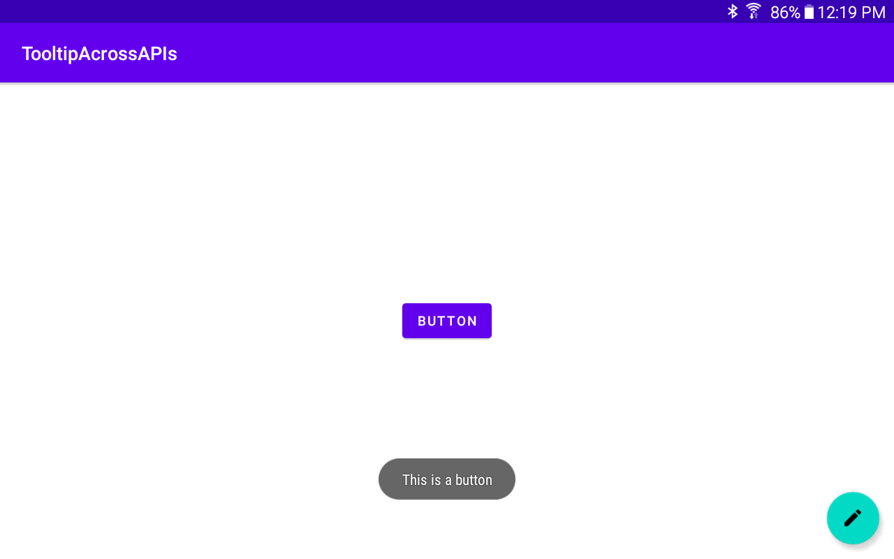
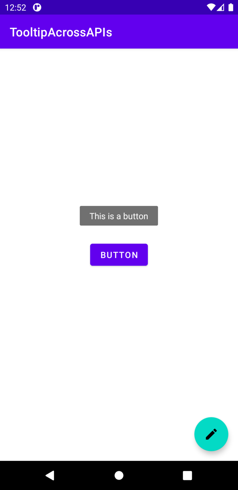

# Tooltips across Android versions

Create tooltips for versions of Android prior to Oreo using a simple function.

``` Kotlin
fun createTooltip(view: View, message: String) {
    if (Build.VERSION.SDK_INT >= 26) {
        view.tooltipText = message
    }
    else {
        view.setOnLongClickListener {
            Toast.makeText(this, message, Toast.LENGTH_SHORT).show()
            true
        }
    }
}
```

See [MainActivity.kt](app/src/main/java/com/richardcaballero/tooltipacrossapis/MainActivity.kt).

## Result

### v21



### v30


